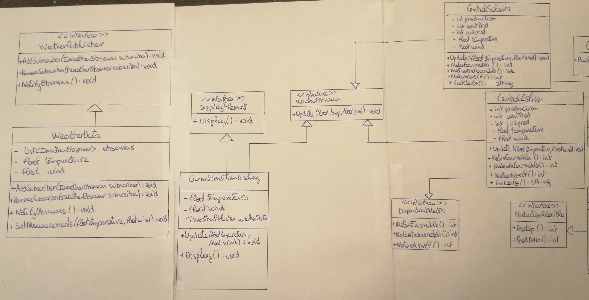
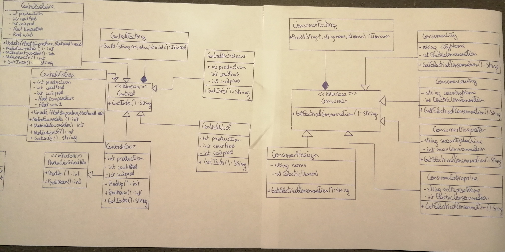
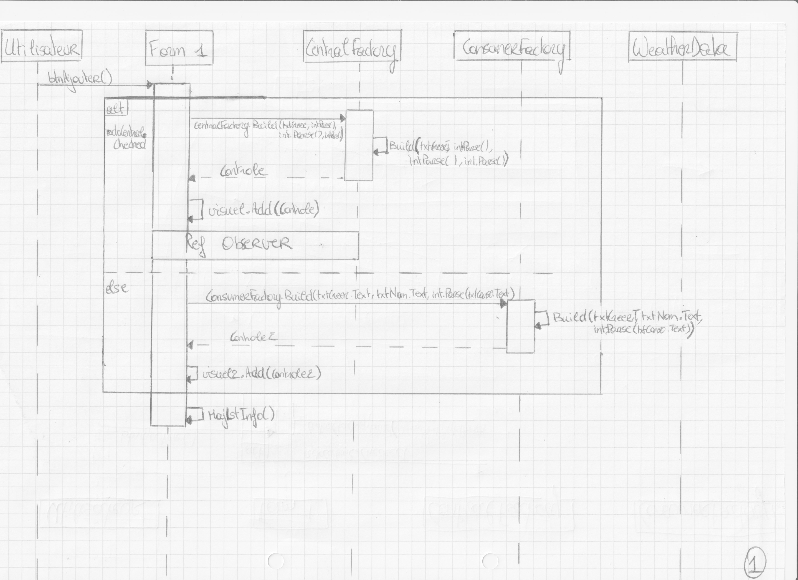

# Document pour les chercheurs 
## Projet POO BA3 2020-2021

Dans le cadre de notre cours programmation orienté objet en BA3 nous devions simuler un réseau de consommation électrique. L'utilisateur peut avec le bouton "ajouter" ajouter des centrales et des consommateurs. Avec le bouton "update climat" il peut mettre à jour les conditions climato-graphiques de chaque element. Avec le bouton "ajout connexion" l'utilisateur peut créer un réseau de connexion entre consommateurs et producteurs d'énergie.

Nous voulions que le projet soit facile d'utilisation (user friendly). Dans la programmation nous souhaitions minimiser le couplage et maximiser le cohesion entre les classes et méthodes.

## Designs Patterns utilisés
### Factory pattern
Factory est une "usine" de classe, dans notre projet on a deux factory : "CentralFactory" et "ConsumerFactory". La première factory va permettre de créer n'importe quel type de centrale et la seconde factory a le même but mais pour les consommateurs. La méthode Factory est un modèle de conception qui laisse les classes qui l'implémentent décider quelle classe instancier. Une Factory Pattern permet à une classe de reporter l'instanciation aux sous-classes. Le modèle de fabrique est utilisé pour remplacer les constructeurs de classe, en faisant abstraction du processus de génération d'objets afin que le type de l'objet instancié puisse être déterminé au moment de l'exécution.

Dans le cadre de notre projet il est très utile pour simplifier l'input de création. Si nous voulons rajouter des nouvelles centrales ou consommateurs nous devons simplement rajouter au factory correspondant une ligne de code et créer la classe en question. Nous devons pas toucher au reste du code. Ceci aide à garder notre programme ouvert à l'extension mais fermé aux modifications.

### Observer Pattern
L’Observateur est un patron de conception comportemental qui permet à certains objets d’envoyer des notifications concernant leur état à d’autres objets.
Dans notre cas, la classe observée est WeatherData. Son rôle est de prévenir les classes qui l'observent d'une mise à jour, ici il s'agit des changements de température et de la force du vent. Si on prend par exemple le cas de la classe CentralEolien, puisque on a souhaité que la météo a un impact sur sa production , on l'a définie comme observateur de la classe WeatherData.

## Recupérer des données 

Nous avons essayé de regrouper les differentes caractéristiques des centrales ou consommateurs par interfaces. Les interfaces en plus d'être un des éléments le plus important en POO aide aussi à l'organisation du code. La visibilité et la clarté des classes y gagnent beaucoup. 

### pour une centrale ...

Toutes nos classes représentant des centrales héritent de l'interface "ICentral" qui contient la méthode se type Sring "GetInfo()". De ce fait, il est possible pour chaque centrale de récupérer ses caractéristiques :production électrique, coût de production et quantité de CO2 émise en utilisant cette méthode.

### pour un consommateur ...
En appliqaunt le même principe que pour les consommateurs, on a une interface "IConsumer" contenant également une méthode de type String mais cette fois appellée "GetElectricalConsommation()". Tous les consommateurs héritent donc de cette interface, ce qui permet de récupérer la consommation électrique de chaque consommateur.

### Bourse
La bourse est définie par le chercheur lui-même avant de lancer le programme il peut modifier et ajouter des valeurs dans les lignes appropriées.

### Sauvegarde données?

Nous avons envisagé une sauvegarde de données avec Serialise. (le code essayé est en commentaire dans Form1) Nous avions cependant des erreurs d'exécution car nous essayions de sauvegarder deux fichiers (consommateurs et producteur) et si par la suite d'autres classes s'ajoutait le même problème persisterai. Nous sommes alors passé à autre chose. Nous pensons cependant que le problème peut être réglé si les différents fichiers étaient rajoutés par une classe qui elle instantie alors le fichier final qui lui se ferait sauvegarder. Comme il fallais seulement " envisager le stockage " nous avons préféré nous concentrer sur d'autres problèmes. 

## Diagramme de classe

## Diagramme de séquence 

